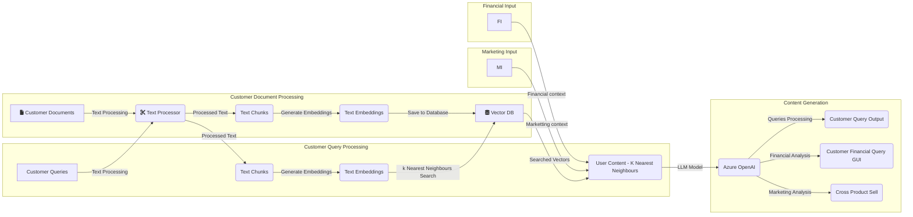

# ServiceGenie
Bulding Customer Service using RAG and LLM

# Problem Statement

Gap in content driven customer service. Issues:
- Increase in customer base and increase in the customer queries.
- High cost to create content driven customer service. High man power as well high resources and time. 
- Losing good customers due to poor communications and hence losing potential customer and business.
- Lack of timely response to customers.
- Lack of common platform to know customer’s issues.

# Why are we solving this Problem statement?

- Enhance the customer service experience by leveraging generative AI technologies to provide personalized, efficient, and proactive support across multiple channels. 
- Automating customer service will reduce cost.
- With increase in customer queries, there is need to increase the resources, AI can help to reduce the burden on the existing resources.
- Increase in timely content driven message to customers, will lead to high customer retention. 
- Timely building features for issues which are faced by customers.

