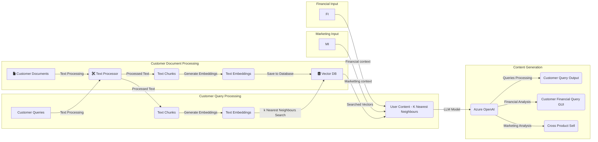

# ServiceGenie

**Building customer service with RAG and LLMs** — architecture and problem framing for a content-driven support platform.

> This repository currently documents the system design (diagrams and problem statement). Implementation code may be added in follow-up repos.

## Problem

Growing customer bases increase support volume, but content-driven answers are expensive to produce and maintain. Gaps lead to slow responses, inconsistent messaging, and churn.

## Goals

- Personalized, efficient support across channels using generative AI
- Lower cost per ticket by automating retrieval-augmented responses
- Faster feature iteration from aggregated customer issue signals
- Higher retention through timely, accurate answers

## High-level architecture

```mermaid
flowchart LR
    subgraph Customer Document Processing
        A[fa:fa-file Customer Documents] -->|Text Processing| T(fa:fa-scissors Text Processor)
        T -->|Processed Text| B(Text Chunks)
        B -->|Generate Embeddings| C(Text Embeddings)
        C -->|Save to Database| D[fa:fa-database Vector DB]
    end
    subgraph Customer Query Processing
        E[Customer Queries] -->|Text Processing| T
        T-->|Processed Text| F(Text Chunks)
        F -->|Generate Embeddings| G(Text Embeddings)
        G -->|k Nearest Neighbours Search| D[fa:fa-database Vector DB]
        D -->|Searched Vectors| R(User Content - K Nearest Neighbours)
    end
    subgraph Content Generation
    R --> |LLM Model| M(Azure OpenAI)
    M --> |Queries Processing| Q(Customer Query Output)
    M --> |Financial Analysis| I(Customer Financial Query GUI)
    M --> |Marketing Analysis| J(Cross Product Sell)
    end
    subgraph Marketing Input
    MI --> |Marketting context| R
    end
    subgraph Financial Input
    FI --> |Financial context| R
    end
```

## Planned stack (from design)

| Component | Technology |
|-----------|------------|
| Embeddings & retrieval | Vector database, k-NN search |
| Generation | Azure OpenAI |
| Domains | Support Q&A, financial insights, cross-sell |

## Author

[Ratnesh Chandak](https://github.com/ratnesh93)
